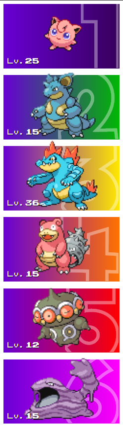

# Big Numbers
This is a theme built by [Jezzabel](https://twitter.com/ThatStreamerJez)

## Preview

## Features
 - **Beautiful Animation** When switching Pokémon, the level and sprite will slide in
 - **Level** is displayed in the corner of each sprite
 - **Slot Number** is shown in the background
 - **Configurable Backgrounds** The background of each card can be switched to be default (set colours), the type colour(s), using a faded version of the tcg art, or a combination of all of the above

## Settings

### Using the card art in the background
You can use the card art in the background by appending `&useCardArtBackground=true` in the URL

### Using the type colour(s) in the background
You can use the card art in the background by appending `&useTypesGradient=true` in the URL

**Note** *If both are used, the order will be TCG Art, then the type colours overlayed, then the pokemon.*

### Use this theme horizontal
You can flip this theme into horizontal mode by appending `&horizontal=true` in the URL
