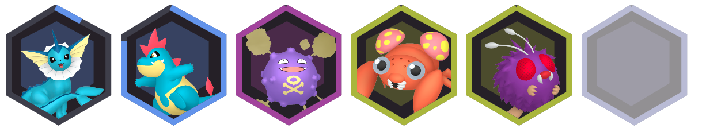

# Digital Hex
This theme was designed and built by [Jezzabel](https://twitter.com/ThatStreamerJez)

## Preview

## Features
 - **HP** is shown in the outer ring
 - **Type Color** is shown on the outer HP ring of the pokemon, as well as the on the hexagon behind the pokemon in the background.
 - **Fainted Pokemon** - Pokémon fade out to a lower opacity when fainted
 - **Staggered** pattern of the hexagons

## Settings
### Flattening the layout into a single row
The staggered pattern can be turned off adding `&flat=true` to the end of your web source url

### Disable the border being used as a HP bar
To disable the border around the hexagon animating as a Pokémon's health decreases, you can add `&hide_hp=true` to the web source url and this will be disabled.
