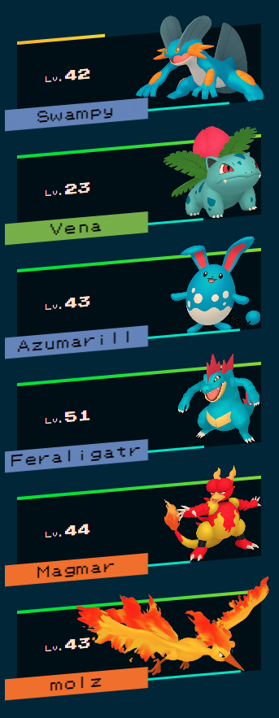

# Jezzabel's Personal Theme (Mk. 1)
This is a theme built by [Jezzabel](https://twitter.com/ThatStreamerJez)

## Preview

## Features
 - **Experience Bars** are shown on the bottom of the pokemon, to the right of the Pokémon's name
 - **Level** On the left hand side of the pokemon sprite
 - **Full Generation Support** By default this theme uses the Pokémon home sprites so will work for pokemon of all generations
 - **Health Bar** is shown in varying colours depending on the percentage of remaining health
 - **Animated Slot Switching** When switching pokemon in your party, the pokemon will animate up and down to their new positions.
 - **Fainted pokemon** When a pokemon faints, it will "grey-out".
 - **Damage Animations** When a pokemon takes damage, it will flash red 7 times for a total of ~2 seconds.
 - **Poison Status Animations** When a pokemon is poisoned, the sprite will shake from side to side, and briefly flash purple (Game Dependant)
 - **Sleep Status Animations** When a pokemon is asleep, 3 subtle fading Z's will animate from the top of it (Game Dependant)
 -
## Settings

### Flip the theme on the X axis
You can flip this to be "mirrored", useful for 2-player collaborations, just add `&flipped=true` in the URL
