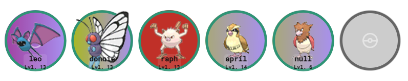

# Round HP
This is a theme built by [fnch](https://twitter.com/fnch_gg).

## Preview
**Main Theme**

**Badges with Gym Ace Levels**

> **NOTE**: The rest of the badges appear below but were cropped for preview purposes

## Features
 - **HP** is shown around the Pokémon and is updated dynamically
 - **HP Color** HP color changes at 50% and 20%
 - **Nickname** is shown in the box below each
 - **Level** Level is also shown below the Pokémon nickname
 - **Background** Background color is displayed using the Pokémon's type

## Settings

### Verticall vs Horizontal Layout
By defaultt the theme works in a horizontal layout. For optimal layout:

- Set the height to 180 in the OBS Source
- Set the width to 890. You can increase this width to add more spacing between Pokémon

To create a vertical Layout, just invert these values between width and height.

> No matter if you're going for horizontal or vertical, after the source is configured in OBS, you can resize the visual widget in the stream editor.
### Pokemon Gen 7 Art
This theme relies on Gen 7 Art provided by PokeLink. However the sprites can be updated to other PokeLink supported sprites by updating the `imgPaths` in `./assets/js/themeSettings.js`

### Badge Ace Pokémon Limit numbers

You can add the limit numbers of the gym's Ace pokemon. 

- Copy the badges theme URL
- Add the badge numbers using the `gymAces` parameter separating them by a comma
- Example: `http://assets.pokelink.xyz/themes/round-hp/index.html?user=fnch&server=localhost&port=3000&gymAces=14,21,24,29,43,43,47,50`
